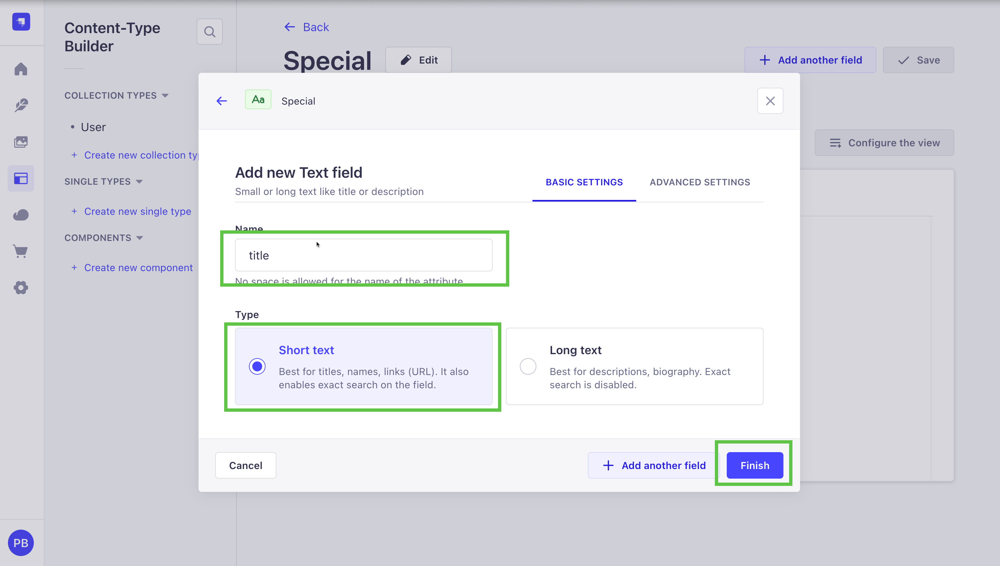
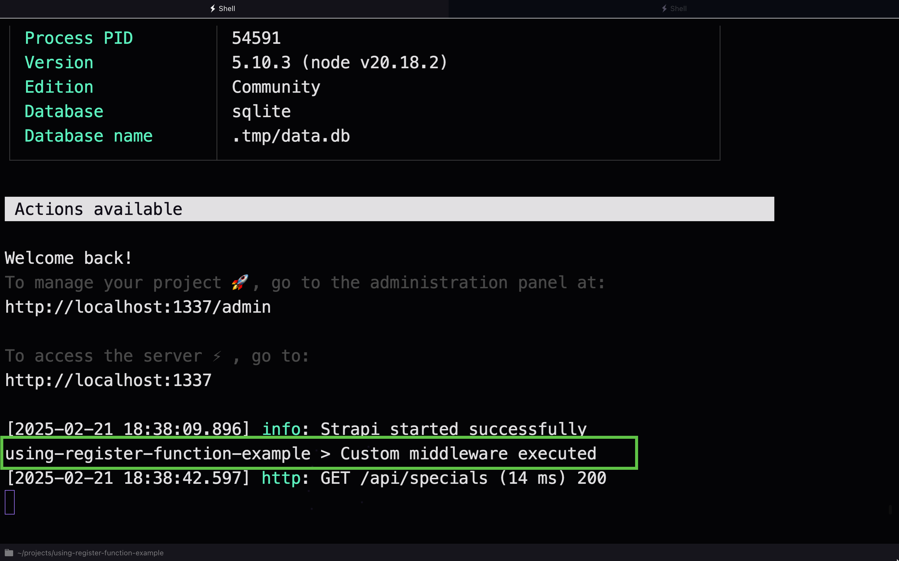

# How To Use Register Function To Add Custom Routes/ContentTypes/Controllers/(Policies/Middlewares)

## Introduction

In Strapi, you can modify and customize the code in many different ways. One of the most common ways is to use the `register` and `bootstrap` functions.

You can learn more about them [here](https://docs.strapi.io/dev-docs/configurations/functions).

However, in this article, we will focus on the `register` function.

This will allow you to register and initialize different services available in the application.

You can find it in the `src/index.ts` file.

``` typescript
// import type { Core } from '@strapi/strapi';

export default {
  /**
   * An asynchronous register function that runs before
   * your application is initialized.
   *
   * This gives you an opportunity to extend code.
   */
  register(/* { strapi }: { strapi: Core.Strapi } */) {},

  /**
   * An asynchronous bootstrap function that runs before
   * your application gets started.
   *
   * This gives you an opportunity to set up your data model,
   * run jobs, or perform some special logic.
   */
  bootstrap(/* { strapi }: { strapi: Core.Strapi } */) {},
};

```

The `register` function will be called when the application starts up.

The `bootstrap` function will be called when the application gets started.

Register function can be used to register routes/contentTypes/controllers/services/cronJobs/(policies/middlewares).

It takes in the strapi object as an argument, which is the main object used to access all the different functionalities of the application, including services, middleware, content types, and more. 

This will allow you to modify how the services are registered and initialized, add new services, or remove existing ones.

This is also can be done via a **Plugin** inside the `server/src/register.ts` file. We will take a look at it later in the article.

## Where are all the objects located in the strapi object:

### Plugin / API

**Plugins:** The plugins are registered and available under the `strapi.plugins` object. Each plugin can be accessed by its name, `strapi.plugins.<pluginName>`

**API:** The APIs are registered and available under the `strapi.api` object. Each plugin can be accessed by its name, `strapi.api.<contentTypeName>` both `strapi.api` and `strapi.plugins` objects contain child objects that provide additional functionality to the application. 

These child objects include routes, controllers, services, policies, and middlewares. They handle incoming HTTP requests, handle the logic, contain reusable utility functions, and are executed before or after specific routes to perform tasks such as authentication, validation, or logging.

### Middlewares

**Middlewares:** The middlewares are registered and available under the `strapi.middlewares` object. Each middleware can be accessed by its name, `strapi.middlewares.<middlewareName>`. Middlewares can also be accessed through strapi.plugins.`<pluginName>.middlewares.<middlewareName>` or `strapi.api.<contentTypeName>.middlewares.<middlewareName>` if they are defined within that specific plugin or API.

### Policies

**Policies:** The policies are registered and available under the `strapi.policies` object. Each policy can be accessed by its name, `strapi.policies.<policyName>`. Policies are used to set the rules and permissions for specific routes in your application; they are executed before the route's action and can be used to perform tasks such as authentication or validation. Policies can also be defined in the `strapi.api.<contentTypeName>.policies.<policyName>` and `strapi.plugins.<pluginName>.policies.<policyName>` if they are defined within a specific plugin or API.

### Services

**Services:** The services are registered and available under the `strapi.services` object. Each service can be accessed by its name, `strapi.services.<serviceName>`. Services can also be accessed through strapi.plugins.<pluginName>.services.<serviceName> or `strapi.api.<contentTypeName>.services.<serviceName>` if they are defined within that specific plugin or API.

### Content Types

**Content Types:** The Content Types are registered and available under the `strapi.contentTypes` object. Each Content Type can be accessed by its name, `strapi.contentTypes.<contentTypeName>`. Additionally, it can also be accessed through the `strapi.api.<contentTypeName>.contentTypes.<contentTypeName>` or `strapi.plugins.<pluginName>.contentTypes.<contentTypeName>` if it is defined within a specific plugin or API.

### Components

**Components:** The components are registered and available under the `strapi.components` object. Each component can be accessed by its uid, `strapi.components.<componentName>`.

### Configurations

**Configurations:** The configurations are registered and available under the `strapi.config` object. Each configuration can be accessed by its key, `strapi.config.<configKey>`.

#### Cron Jobs

**Cron Jobs:** Cron jobs are stored in the config and must be enabled to work. You can navigate to the `strapi.config.cron` object to access them. All cron jobs are stored within this object.

You can find more details on how to create and configure cron jobs in the Strapi documentation:
[link to docs](https://docs.strapi.io/developer-docs/latest/setup-deployment-guides/configurations/optional/cronjobs.html#creating-a-cron-job)

## Examples

### 1. Setup

Setup a normal strapi instance. You can do so by running `npx create-strapi-app@latest my-strapi-app` and following the instructions.

Once you have created the app, change into the directory by running `cd my-strapi-app` and then you can start it by running `npm run develop`.

You will be asked to create your first **Admin User**.  


Once you have done that, go ahead and in the content-type-builder create a new contentType named `special` with the following field `title` what will be a `short text field`.


Click continue and add your first field.



Now that is done, lets look at how to inject a custom middleware into a route.

### 2. Injecting a Custom Middleware into a Route

To inject a custom middleware into a route, you first need to define your middleware and then register it within the desired route. 

Here's an example of how you can achieve this:

1. **Define the Middleware**:
   Create a file named `customMiddleware.ts` in your `src/middlewares` folder:

``` typescript
export default (config, { strapi })=> {
  // Custom middleware logic
  return async (ctx, next) => {
    console.log("Custom middleware executed");
    await next();
  };
};
```

2. To test if this succeeded we will start strapi up in console mode aka `npm run strapi console` then after it is loaded you are an interactive console version of strapi where you will type in `strapi.middlewares` and you should now see in the list `'global::customMiddleware': [AsyncFunction (anonymous)],`


Notice that we can see our newly created middleware in the list.
3. **Register the Middleware**:
   In your `register` function in the `src/index.ts` file, you can inject this middleware into a specific route:

``` typescript
// src/index.ts
import type { Core } from '@strapi/strapi';

export default {
  /**
   * An asynchronous register function that runs before
   * your application is initialized.
   *
   * This gives you an opportunity to extend code.
   */
  register({ strapi }: { strapi: Core.Strapi }) {
    const middleware = "global::customMiddleware";
    const routesPath = strapi.apis.special.routes.special.routes;

      console.log(routesPath, "routesPath");
      console.log(middleware, "middleware");

      const registerIndex = routesPath.findIndex(
        (route) => route.path === "/specials" && route.method === "GET"
      );

    console.log(registerIndex, "registerIndex");

    const registerRoute = routesPath[registerIndex];
      if (registerRoute.config.middlewares === undefined) {
        registerRoute.config.middlewares = [];
      }
    registerRoute.config.middlewares.push(middleware);
  },

  /**
   * An asynchronous bootstrap function that runs before
   * your application gets started.
   *
   * This gives you an opportunity to set up your data model,
   * run jobs, or perform some special logic.
   */
  bootstrap(/* { strapi }: { strapi: Core.Strapi } */) {},
};

```

3. Now to test if this worked as expected go to make a **GET** request to `http://localhost:1337/api/specials` now you should see a console.log in your strapi console.

Just make sure to set the permissions in `users-permissions` plugin to `public` so that the route is accessible.


And you should see the following in your strapi console:


## Using Register Function Inside a Plugin

Let's start by creating a simple plugin that we will use to inject a middleware into a route.

We will use the [**Plugin CLI**](https://github.com/strapi/sdk-plugin) to create a new plugin.

We will run the following command to create a new plugin:

```bash
  npx @strapi/sdk-plugin@latest init my-plugin
```

You will be prompted to enter the following information:

```bash
✔ plugin name … my-plugin
✔ plugin display name … My Plugin
✔ plugin description … Testing things
✔ plugin author name … Paul Brats
✔ plugin author email … paul.bratslavsky@strapi.io
✔ git url … 
✔ plugin license … MIT
✔ register with the admin panel? … yes
✔ register with the server? … yes
✔ use editorconfig? … yes
✔ use eslint? … no
✔ use prettier? … yes
✔ use typescript? … yes
```


This will create a new plugin in the `src/plugins` folder.

To enable our plugin we need to add it to the `config/plugins.js` file.

You can now enable your plugin by adding the following in `config/plugins.ts`

```typescript
export default {
  // ...
  'my-plugin': {
    enabled: true,
    resolve: './src/plugins/my-plugin'
  },
  // ...
}
```

Now, that we have our plugin, let's see how we can inject a middleware into a route via the `my-plugin/server/src/register.ts` file.

Let's make the following changes:

```typescript
import type { Core } from '@strapi/strapi';

const register = ({ strapi }: { strapi: Core.Strapi }) => {
  const middleware = "global::customMiddleware";
    const routesPath = strapi.apis.special.routes.special.routes;

      console.log(routesPath, "routesPath");
      console.log(middleware, "middleware");

      const registerIndex = routesPath.findIndex(
        (route) => route.path === "/specials" && route.method === "GET"
      );

    console.log(registerIndex, "registerIndex");

    const registerRoute = routesPath[registerIndex];
      if (registerRoute.config.middlewares === undefined) {
        registerRoute.config.middlewares = [];
      }
    registerRoute.config.middlewares.push(middleware);
};

export default register;
```

Notice that we are using the same code we used in the `src/index.ts` file in the `register` function inside of our Strapi project. 

Since we are using the plugin to accomplish this, let's remove the code from the `src/index.ts` that we used in the previous example.

The file should now look like this:

``` typescript
// import type { Core } from '@strapi/strapi';

export default {
  /**
   * An asynchronous register function that runs before
   * your application is initialized.
   *
   * This gives you an opportunity to extend code.
   */
  register(/* { strapi }: { strapi: Core.Strapi } */) {},

  /**
   * An asynchronous bootstrap function that runs before
   * your application gets started.
   *
   * This gives you an opportunity to set up your data model,
   * run jobs, or perform some special logic.
   */
  bootstrap(/* { strapi }: { strapi: Core.Strapi } */) {},
};
```

Now, that we have removed the code from the `src/index.ts` file, we can start to test if the plugin is working as expected.

But first navigate to the `src/plugins/my-plugin ` folder and run `npm run build` to build the plugin.

You can also run inti in watch mode by running `npm run watch` this will watch for changes and rebuild the plugin automatically.

Now, let's restart our Strapi instance in console mode by running `npm run strapi console`.

When we make a **GET** request to `http://localhost:1337/api/specials` we should see the same console.log as we did in the previous example.





Congrats, this part is done. Now to explain why this is useful. This means a plugin can dynamically inject middlewares into your strapi instance, this is cool, because it means that you can have a plugin that is responsible for adding custom middlewares to your strapi instance. And if you want to remove it you can just disable/remove the plugin.

This is nice because it allows you to have plugins that add custom data, or functionality to requests or any custom logic, like validation or caching.

Now, let's see how we can programmatically add a component to a contentType.

### 3. Creating a new field and component in a contentType and

Now in the setup we created a contentType called **Special**, let's add a new field to it and a component to it.

1. **Define the Component**:
   Create the component we want to add to the content-type:

```js
strapi.components[`custom.quote`] = {
  collectionName: "components_shared_quotes",
  info: {
    displayName: "Quote",
    icon: "indent",
  },
  options: {},
  attributes: {
    title: {
      type: "string",
    },
    body: {
      type: "text",
    },
  },
  __filename__: "quote.json",
  __schema__: {
    collectionName: "components_custom_quotes",
    info: {
      displayName: "Quote",
      icon: "indent",
    },
    options: {},
    attributes: {
      title: {
        type: "string",
      },
      body: {
        type: "text",
      },
    },
    __filename__: "quote.json",
  },
  uid: "custom.quote",
  category: "custom",
  modelType: "component",
  modelName: "quote",
  globalId: "ComponentSharedQuote",
};
```

2. **Define the Content Type**:
   Create a file named `yourContentType.json` in your content types folder:

```json
// content-types/yourContentType.json
{
  "collectionName": "your_content_type",
  "info": {
    "name": "Your Content Type"
  },
  "attributes": {
    "name": {
      "type": "string"
    },
    "customField": {
      "type": "component",
      "repeatable": false,
      "component": "customComponent"
    }
  }
}
```

3. **Register the Content Type and Component**:
   In your `services/register.js` file, you can register the content type and the component:

```javascript
// services/register.js
module.exports = async ({ strapi }) => {
  // Register the component
  strapi.components[
    "customComponent"
  ] = require("../../components/customComponent.json");

  // Register the content type
  strapi.contentTypes[
    "yourContentType"
  ] = require("../../content-types/yourContentType.json");

  // Continue with other registrations...
};
```

### 4. Adding a Cron Job to the Config File

For the reader to try out, here's an exercise to add a cron job to the Strapi configuration file:

1. **Define the Cron Job**:
   Add the following configuration to your `config/functions/cron.js` file:

```javascript
// config/functions/cron.js
module.exports = {
  "*/5 * * * *": async () => {
    // This cron job runs every 5 minutes
    console.log("Running a task every 5 minutes");
    // Add your cron job logic here
  },
};
```

2. **Enable Cron Jobs**:
   Ensure that cron jobs are enabled in your `config/server.js` file:

```javascript
// config/server.js
module.exports = ({ env }) => ({
  // Other configurations...
  cron: {
    enabled: true,
  },
});
```

By following these examples, you can start customizing your Strapi application by injecting custom middlewares into routes, creating content types with custom components, and adding cron jobs to the configuration file.
